# WORK DAY SCHEDULER🕑

## Purpose❗
 * Create a work day scheduling app 
 * So users can access it to log in goals for hour of their work day

   ## Table of Contents:
1. [ GitHub ](#link-to-my-page)
2. [ Description ](#desc)
3. [ Built With ](#built-with)
4. [ Steps ](#steps)
5. [ Helpful Links ](#help)

 
 ## 1. Link To Project in My Github Pages:octocat:
[Work Day Scheduler App](https://verokoles.github.io/work-day-scheduler/)

## 2. Description✏️
The Work Day Sceduler is powered by JavaScript, jQuery, and moment.js to allow the user to input specific tasks and goals for their workday (9am-5pm). When the task is saved with the 'Save' button, LocalStorage saves the info and can be pulled as well. The time shown in the header is the current time, provided by moment.js. Given the current time and day, whatever row is in the past will be highlighted gray, present will be green, and future will be hihglighted red.
 

## 3. Built With🔨
 * CSS
 * HTML
 * JavaScript
 * Bootstrap
 * jQuery
 * Moment.js
  

 ## 4. Steps:ladder:

   I started by setting up the time blocks in HTML with div classes, textarea and button classes, with corresponding styles in the CSS. Bootstrap and Google fonts API links are called in the head tag of HTML to generate a font family and style for the whole app.
 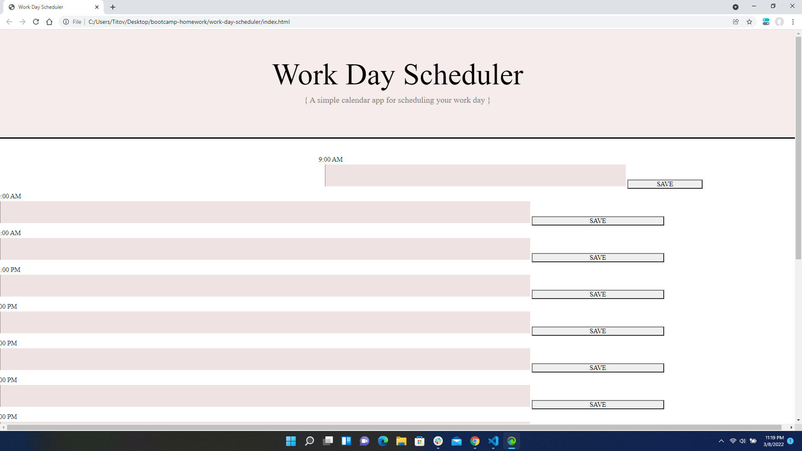
 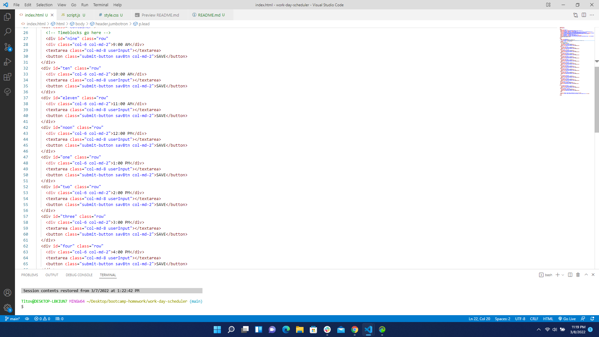

   Setting CSS elements to the HTML like .hour and .time-block formats the rows more evenly spaced and styled. I had to reorder the div tags to make even spacing and height for all the rows/time blocks.
 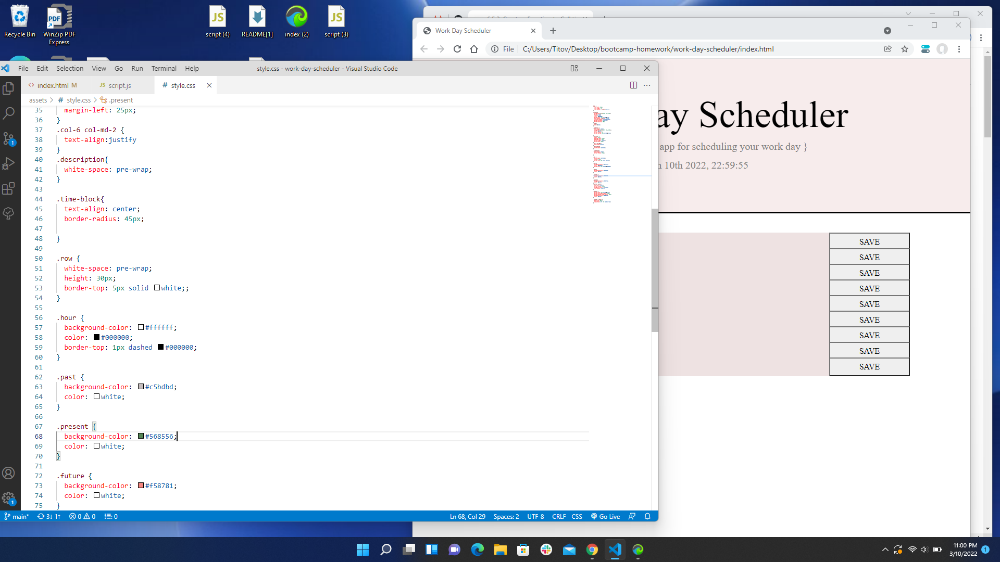
 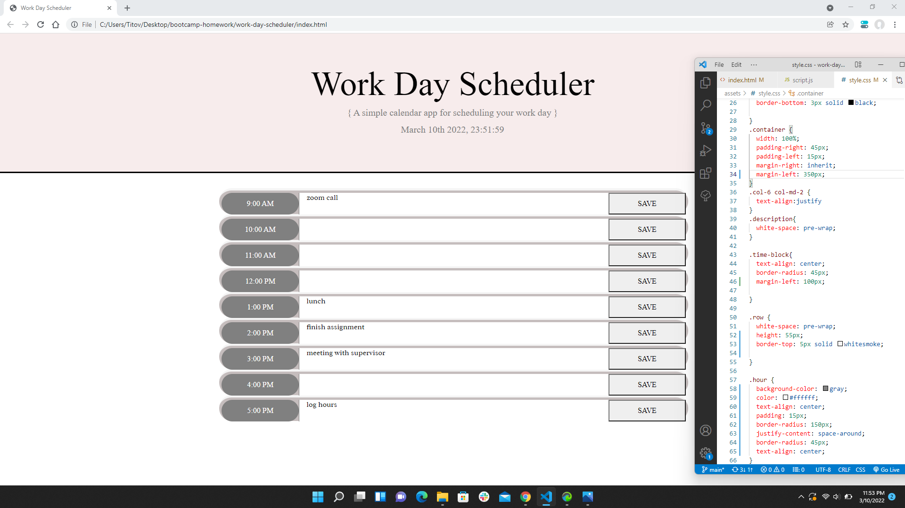

   The moment.js link is placed towards the bottom of the HTML in a script tag right before the main javascript link before the </ body> tag ending. This displays the current date and time in the browser right under the Scheduler title. The line '$("#currentDay").text(moment().format("MMMM Do YYYY, HH:mm")); ' is set to process the time in the .ready function.
 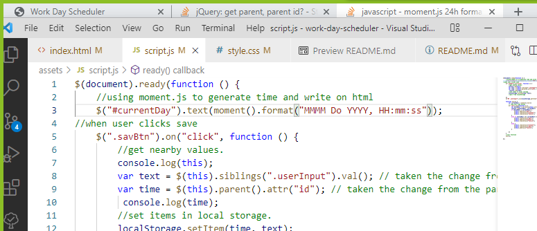

   When a user types in a task and  clicks 'Save', the time and text variables in the script.js set the sibling classes for button, textarea, and divs to the parent ID of the time hour. Once the console is opened with F12, the task is saved to local storage as well as the corresponding time when calling console.log.
 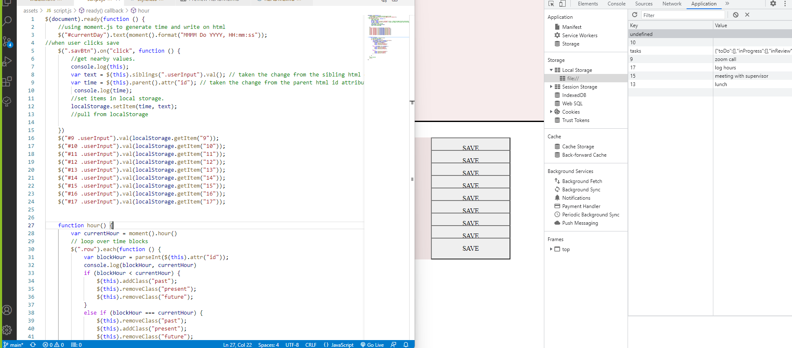

   Setting the div id hours allows the past, present, and future features to actually work instead of just  regular 9, 10, 11, noon, 1, 2, 3 and so on. Instead, the sequence #9-17 tells the LocalStorage to set and get (log in and pull from) the correct hours in 24-hour format, as well as the time read on top of the schedule.
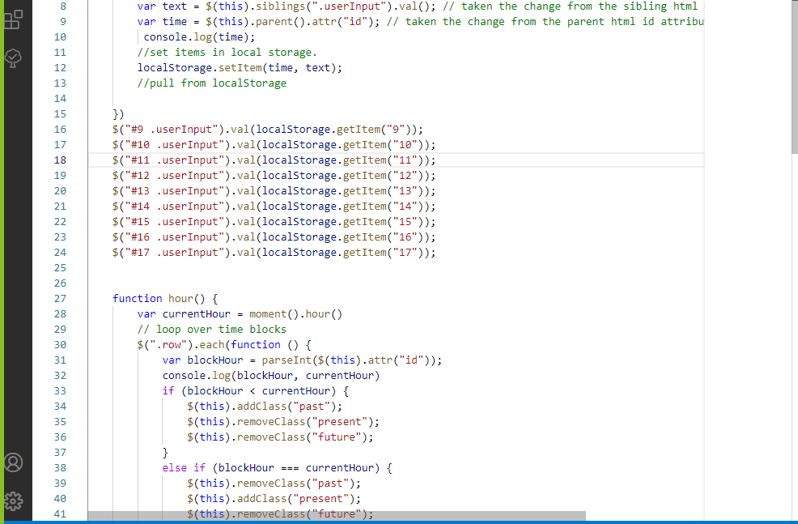
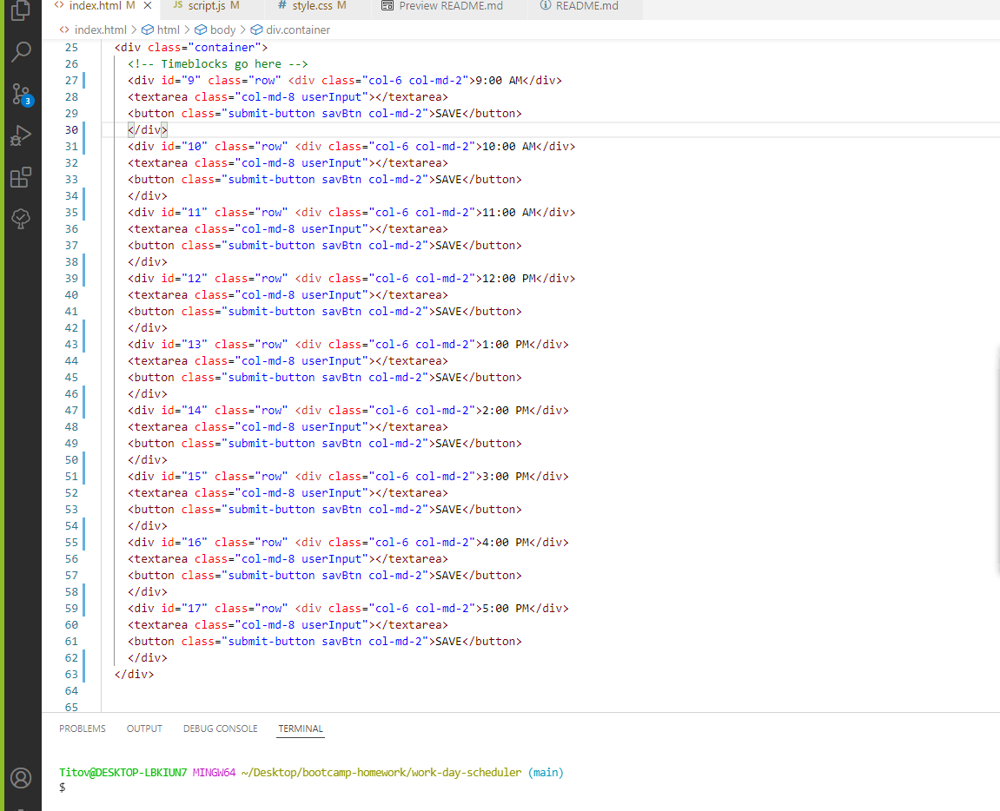

The hour function in JS is what enables the loop for the time blocks to display past hours highlighted in gray, present block in green, and the future blocks in red. So If I log on at 7AM, all the rows will be red. If I am veiwing the schedule at 11AM, 9AM and 10AM will be gray, 11 would be green, and every hour from 12 and on would be red.
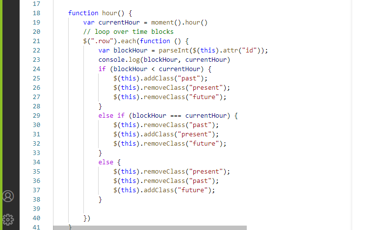
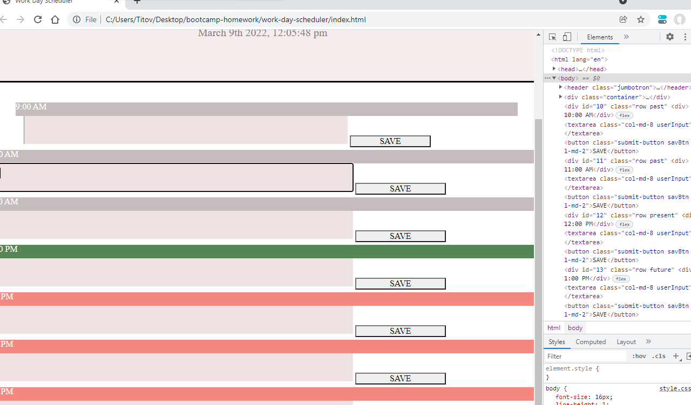

The hour(); call at the bottom of the JS is what applies that function to the entire document or page.
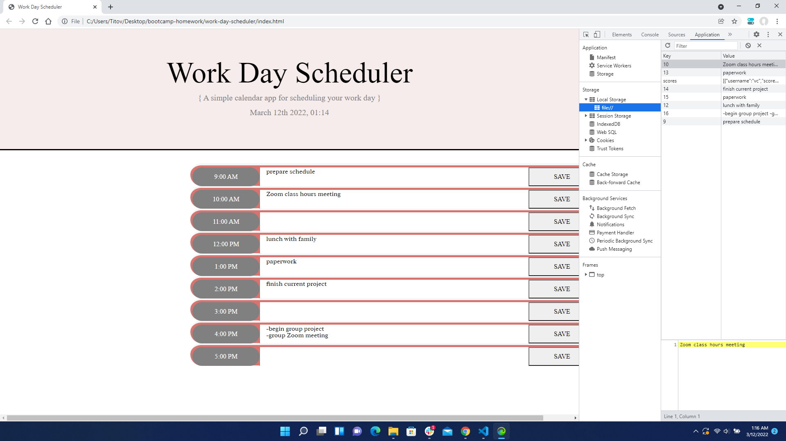

  ## 5. Helpful Links:link:

 * [MOMENT.JS formatting](https://stackoverflow.com/questions/12970284/moment-js-24h-format) 
  
 * [Index of Array](https://www.w3schools.com/jsref/jsref_indexof_array.asp)

 * [Setting Parent Elements and Children](https://stackoverflow.com/questions/10260667/jquery-get-parent-parent-id#:~:text=%24(this).-,parent().,id%20of%20the%20parent's%20parent)

 * [Saving and Retrieving with LocalStorage](https://www.js-tutorials.com/javascript-tutorial/how-to-use-local-storage-with-javascript/)

